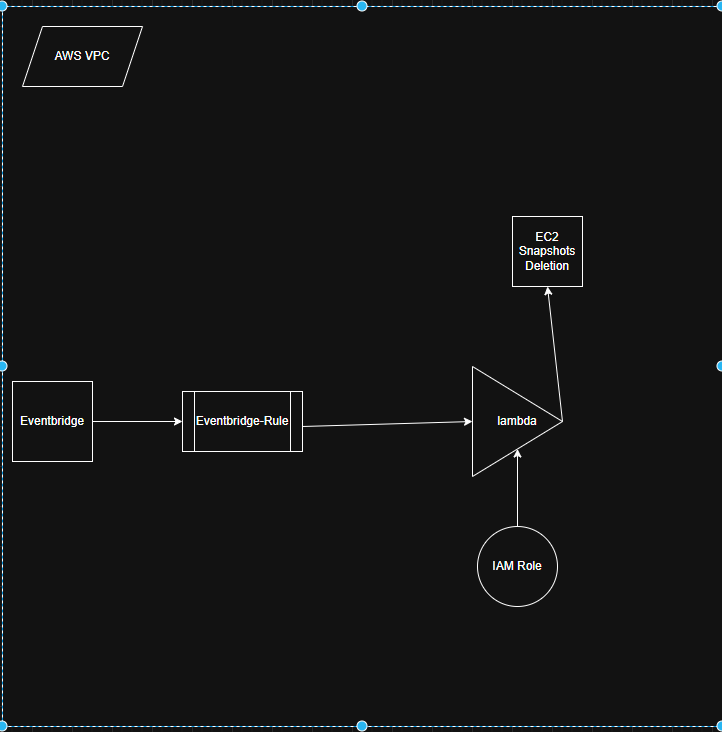
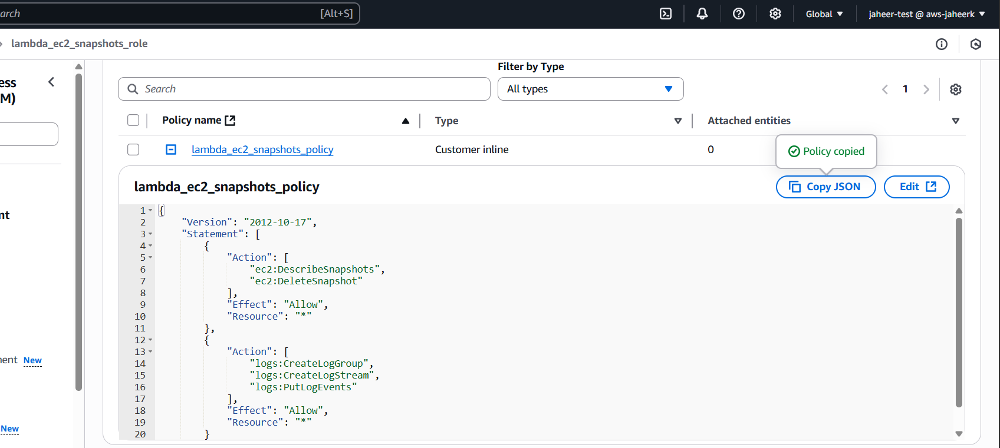
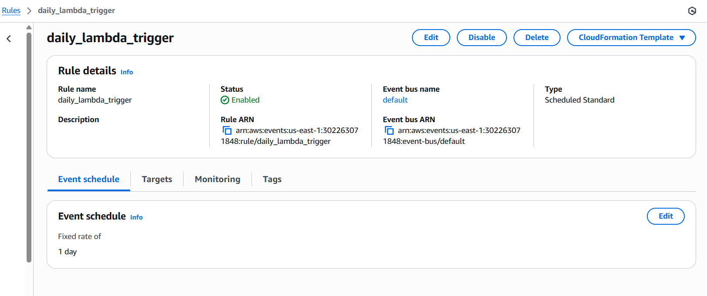
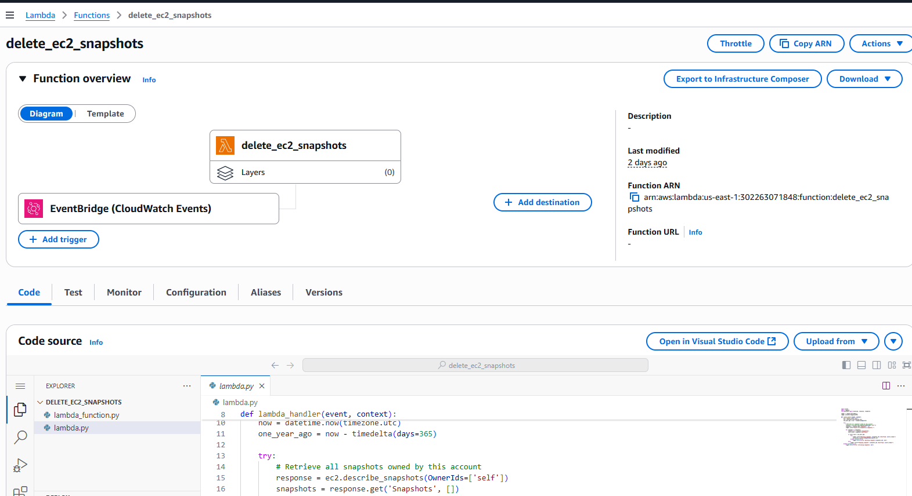
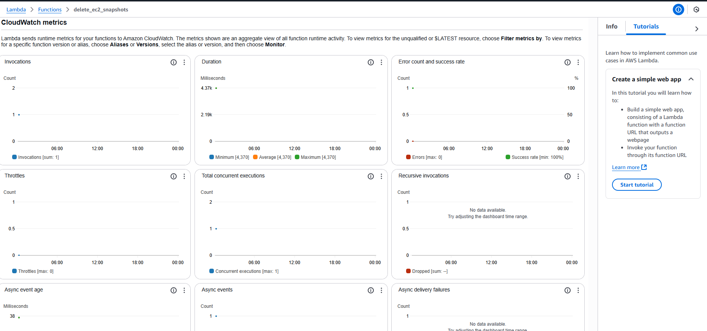
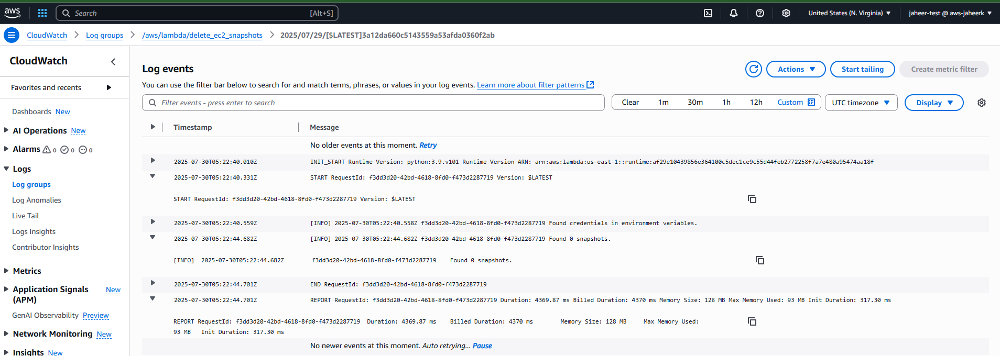

# AWS Lambda deletes older EC2 Snapshot for over 365 days.

AWS Lambda function deletes ec2 snapshots older than 365 days. Here is the python script which has logic to identify snapshots older than 365 days from today date and starts deleting on every day cron schedule as per eventbridge rule configured.

## Features

- Created snapshots older than 365 days will be deleted.
- Automatically cleaning up old snapshots using lambda and eventbridge rule for invocation.

## IaaC - Terraform

Here used terraform since it is easy manage as infrastructure as a code (IaaC) between different cloud env and easy to manage the states/configuration of each resource in s3 backend bucket as statefiles.

- It Offers flexibility in re-using same code by using "Modules".
- Modules will be helpful in centralizing the code and just referencing the code with  input tf.vars
- Code can be managed in github repository and its not bound to specific cloud (unlike CFN's ) and it can be referenced by CI/CD tools like harness, teamcity and jenkins etc., 

## Deployment:
- Here once code gets checked-in raise a PR for branch to merge with main after peer reviewed.
- It will automatically run github actions pipeline and starts running terraform on target env.
- Once deployment is completed start validating resources on cloud.
- Lambda code can deployed as soon as it gets converted as .zip extension as referenced in github workflow yaml file before it gets deployed.
- Lambda function can be referenced with VPC section where we can pass on security group and subnet ID as shown below.

  vpc_config {
    subnet_ids         = []
    security_group_ids = [] 
  }
- Aws region can be variabilized as additional variable with provider block where default value would be east-2 if not passed. In other instance it would be east-1 as per execution region.

- Monitoring can be done by cloud watch logs, Cloudwatch metrics where we can monitor the invocations and also we can go through each request id to follow the pattern series of actions based on logic where loggerinfo is given for logging.

## Architecture



### Terraform commands:-

terraform init

terraform plan -out terraform.tfplan

terraform apply --auto-approve terraform.tfplan

### IAM Role required

1) Create an IAM role for AWS Lambda and add the following inline policy:

```json
{
    "Version": "2012-10-17",
    "Statement": [
        {
            "Action": [
                "ec2:DescribeSnapshots",
                "ec2:DeleteSnapshot"
            ],
            "Effect": "Allow",
            "Resource": "*"
        },
        {
            "Action": [
                "logs:CreateLogGroup",
                "logs:CreateLogStream",
                "logs:PutLogEvents"
            ],
            "Effect": "Allow",
            "Resource": "*"
        },
        {
            "Effect": "Allow",
            "Action": [
                "ec2:CreateNetworkInterface",
                "ec2:DescribeNetworkInterfaces",
                "ec2:DeleteNetworkInterface"
            ],
            "Resource": "*"
        }
    ]
}
```



2) Create a Lambda function and trigger

* Configure triggers
    * Select "CloudWatch Events - Schedule"
    * Choose "rate(1 day)"
    * Enable trigger

* Configure function
    * Enter name
    * Select "Python 3.6" from the Runtime dropdown
    * Check that Handler is "lambda_function.lambda_handler"
    * Choose the previously created IAM role.

3) Check the logs

Check the logs in the CloudWatch Logs area and metrics for lambda invocations.



## Validation


